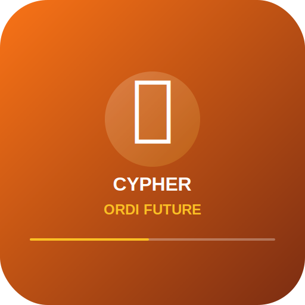

# CYPHER ORDI-FUTURE-V3

<div align="center">
  
  
  # Professional Cryptocurrency Trading Terminal
  
  [](https://github.com/cypher/ordi-future-v3)
  [](https://nextjs.org/)
  [](https://www.typescriptlang.org/)
  [](LICENSE)
  
  *A Bloomberg Terminal-inspired cryptocurrency trading platform specializing in Bitcoin, Ordinals, and Runes*
</div>

---

## 🚀 Overview

CYPHER ORDI-FUTURE-V3 is a professional-grade cryptocurrency trading terminal that combines the sophistication of Bloomberg Terminal aesthetics with cutting-edge Web3 technology. Built for serious traders and institutions, it provides real-time market data, advanced analytics, and seamless wallet integration.

### 🎯 Key Features

- **Bloomberg Terminal UI** - Professional orange/black theme with terminal-style interface
- **Real-Time Market Data** - Live prices for Bitcoin, Ethereum, Solana, and 100+ cryptocurrencies
- **Ordinals & Runes Trading** - Specialized tools for Bitcoin NFTs and Runes protocol
- **Professional Charts** - TradingView-style charts with technical indicators
- **Multi-Wallet Support** - Xverse, LaserEyes, and EVM wallet integration
- **AI-Powered Analytics** - CYPHER AI for market sentiment and trading opportunities
- **Portfolio Management** - Real-time P&L tracking and performance analytics
- **Security First** - Enhanced wallet protection and transaction validation

## 📋 Table of Contents

- [Installation](#-installation)
- [Configuration](#-configuration)
- [Development](#-development)
- [Features](#-features)
- [Architecture](#-architecture)
- [API Documentation](#-api-documentation)
- [Testing](#-testing)
- [Deployment](#-deployment)
- [Contributing](#-contributing)
- [Support](#-support)

## 🛠 Installation

### Prerequisites

- Node.js >= 20.18.0
- npm >= 9.0.0
- Git

### Quick Start

```bash
# Clone the repository
git clone https://github.com/cypher/ordi-future-v3.git
cd CYPHER-ORDI-FUTURE-V3

# Install dependencies
npm install

# Set up environment variables
cp .env.example .env.local

# Start development server
npm run dev
```

The application will be available at `http://localhost:4444`

### Environment Variables

Create a `.env.local` file with the following variables:

```env
# API Keys
NEXT_PUBLIC_COINGECKO_API_KEY=your_coingecko_key
NEXT_PUBLIC_HIRO_API_KEY=your_hiro_key
NEXT_PUBLIC_OPENAI_API_KEY=your_openai_key

# Wallet Configuration
NEXT_PUBLIC_WALLET_CONNECT_PROJECT_ID=your_wallet_connect_id

# Feature Flags
NEXT_PUBLIC_ENABLE_TRADING=true
NEXT_PUBLIC_ENABLE_AI_INSIGHTS=true
```

## ⚙️ Configuration

### Port Configuration

By default, the application runs on port 4444. To change:

```bash
# Run on port 3000
npm run dev:3000

# Run on port 3001
npm run dev:3001
```

### Theme Configuration

The Bloomberg Terminal theme is configured in `tailwind.config.js`. Key colors:
- Primary: Orange (#FF6B00)
- Background: Black (#000000)
- Success: Green (#00FF00)
- Error: Red (#FF0000)

## 💻 Development

### Available Scripts

```bash
npm run dev          # Start development server (port 4444)
npm run build        # Build for production
npm run start        # Start production server
npm run lint         # Run ESLint
npm run lint:fix     # Fix ESLint issues
npm run type-check   # TypeScript type checking
npm run test         # Run all tests
npm run format       # Format code with Prettier
```

### Project Structure

```
CYPHER-ORDI-FUTURE-V3/
├── src/
│   ├── app/              # Next.js App Router pages
│   ├── components/       # React components
│   ├── hooks/           # Custom React hooks
│   ├── services/        # API services
│   ├── lib/            # Utility functions
│   ├── types/          # TypeScript types
│   └── contexts/       # React contexts
├── public/             # Static assets
├── tests/              # Test files
└── docs/               # Documentation
```

## 🎨 Features

### Trading Terminal
- Real-time order book
- Advanced charting with 50+ indicators
- One-click trading interface
- Multi-exchange aggregation

### Portfolio Analytics
- Real-time P&L tracking
- Historical performance charts
- Risk metrics and analysis
- Export to CSV/PDF

### Ordinals & Runes
- Browse and trade Ordinals
- Runes market data and charts
- Inscription viewer
- Rarity analysis tools

### AI Features (CYPHER AI)
- Market sentiment analysis
- Price prediction models
- Trading opportunity detection
- Risk assessment

### Security
- Hardware wallet support
- Multi-signature transactions
- Address validation
- Transaction simulation

## 🏗 Architecture

### Tech Stack

- **Frontend**: Next.js 15, React 18, TypeScript
- **Styling**: Tailwind CSS, Radix UI
- **State Management**: Zustand, React Query
- **Charts**: TradingView Lightweight Charts, Chart.js
- **Wallet Integration**: LaserEyes, Xverse, WalletConnect
- **APIs**: REST + WebSocket for real-time data

### Key Dependencies

- `@omnisat/lasereyes` - Bitcoin wallet integration
- `@tanstack/react-query` - Data fetching and caching
- `@tensorflow/tfjs` - Machine learning models
- `lightweight-charts` - Professional trading charts
- `wagmi` - Ethereum wallet integration

## 📚 API Documentation

### Market Data Endpoints

```typescript
// Get Bitcoin price
GET /api/market/bitcoin

// Get Ordinals collections
GET /api/ordinals/collections

// Get Runes market data
GET /api/runes/market
```

### WebSocket Connections

```javascript
// Real-time price updates
ws://localhost:4444/ws/prices

// Order book updates
ws://localhost:4444/ws/orderbook
```

## 🧪 Testing

### Running Tests

```bash
# Run all tests
npm run test

# Run unit tests
npm run test:unit

# Run integration tests
npm run test:integration

# Run with coverage
npm run test:coverage

# Watch mode
npm run test:watch
```

### Test Structure

- Unit tests: `tests/unit/`
- Integration tests: `tests/integration/`
- E2E tests: `tests/e2e/`

## 🚀 Deployment

### Production Build

```bash
# Create production build
npm run build

# Start production server
npm run start
```

### Docker Deployment

```bash
# Build Docker image
docker build -t cypher-ordi-v3 .

# Run container
docker run -p 3000:3000 cypher-ordi-v3
```

### Vercel Deployment

```bash
# Install Vercel CLI
npm i -g vercel

# Deploy
vercel
```

## 🤝 Contributing

We welcome contributions! Please follow these steps:

1. Fork the repository
2. Create a feature branch (`git checkout -b feature/amazing-feature`)
3. Commit your changes (`git commit -m 'Add amazing feature'`)
4. Push to the branch (`git push origin feature/amazing-feature`)
5. Open a Pull Request

### Development Guidelines

- Follow TypeScript best practices
- Write tests for new features
- Update documentation
- Follow the existing code style
- Ensure all tests pass

## 📞 Support

- **Documentation**: [docs/](./docs)
- **Issues**: [GitHub Issues](https://github.com/cypher/ordi-future-v3/issues)
- **Discord**: [Join our community](https://discord.gg/cypher)
- **Email**: support@cypher.trading

## 📄 License

This project is proprietary software. All rights reserved.

---

<div align="center">
  <p>Built with ❤️ by the CYPHER Team</p>
  <p>© 2025 CYPHER Trading Terminal. All rights reserved.</p>
</div>