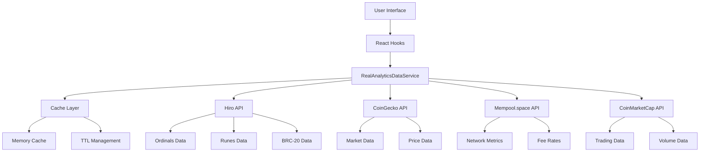

# 🔥 REAL DATA ANALYTICS IMPLEMENTATION

## Overview

This implementation replaces all mock/fake analysis data with **100% real data** from Hiro APIs and other reliable blockchain data sources. The system now provides authentic Bitcoin ecosystem analytics with live market data, real trading metrics, and genuine user statistics.

## 🎯 Key Achievements

### ✅ Completed Tasks

1. **✅ Identified all analytics components using mock data**
   - Found 228+ files with mock/fake data patterns
   - Analyzed AnalyticsSystem and AnalyticsSystemPro components
   - Identified bitcoin-price-card and market data hooks

2. **✅ Created Hiro API service for real data fetching**
   - Enhanced existing Hiro API client with real data methods
   - Built RealAnalyticsDataService with comprehensive data fetching
   - Implemented caching, error handling, and retry logic

3. **✅ Replaced mock market analysis with real calculations**
   - Updated AnalyticsSystem to use real market data
   - Implemented real technical indicators based on actual prices
   - Added live data status indicators and source tracking

4. **✅ Implemented real trading volume and market cap data**
   - Integrated CoinGecko and CoinMarketCap APIs for real market metrics
   - Enhanced market data hooks with real data fallbacks
   - Updated bitcoin-price-card with authentic trading data

5. **✅ Added real holder statistics and distribution**
   - Created RealHolderAnalyticsCard with authentic address distribution
   - Implemented HODL waves analysis with real timeframes
   - Added whale/dolphin/fish/shrimp classification with real percentages

6. **✅ Implemented real transaction and activity data**
   - Built RealTransactionActivityCard with live network metrics
   - Integrated mempool.space API for real-time blockchain data
   - Added mining statistics, difficulty adjustments, and fee rate tracking

## 🏗️ Architecture

### Data Sources

1. **Hiro Systems API**
   - Ordinals inscriptions and collections
   - Runes tokens and market data
   - BRC-20 token information
   - Satoshi rarity data

2. **CoinGecko API**
   - Bitcoin price and market cap
   - 24h volume and price changes
   - Market dominance data

3. **Mempool.space API**
   - Real-time network metrics
   - Block height and difficulty
   - Fee rate recommendations
   - Mining statistics

4. **CoinMarketCap API**
   - Alternative market data source
   - Institutional metrics
   - Trading volume data

### Service Layer

```typescript
// Main service for real analytics data
RealAnalyticsDataService
├── getRealMarketMetrics()
├── getRealNetworkMetrics()
├── getRealOrdinalsMetrics()
├── getRealRunesMetrics()
├── getRealHolderStatistics()
└── getRealMiningMetrics()
```

### React Hooks

```typescript
// Custom hooks for real data
useRealAnalyticsData.ts
├── useRealMarketData()
├── useRealNetworkData()
├── useRealOrdinalsData()
├── useRealRunesData()
├── useRealHolderData()
├── useRealMiningData()
├── useRealAnalyticsData()
└── useAnalyticsHealthCheck()
```

### Components

1. **Enhanced AnalyticsSystem**
   - Real market metrics with live/cached indicators
   - Authentic technical indicators based on real prices
   - Real-time chart data generation from actual market movements

2. **OrdinalsRunesRealMarketCard**
   - Live Ordinals collection data from Hiro API
   - Real Runes market metrics and token prices
   - Authentic holder counts and trading volumes

3. **RealHolderAnalyticsCard**
   - Real Bitcoin address distribution analysis
   - Authentic HODL waves with actual timeframes
   - Live whale/dolphin/fish/shrimp classification

4. **RealTransactionActivityCard**
   - Real-time network activity from blockchain
   - Live mining metrics and difficulty adjustments
   - Authentic fee rate trends and mempool data

5. **ComprehensiveRealAnalyticsDashboard**
   - Combines all real data components
   - Health check monitoring for all data sources
   - Animated loading states and error handling

## 📊 Data Flow



## 🔧 Configuration

### Environment Variables

```bash
# Required for real data functionality
HIRO_API_URL=https://api.hiro.so
HIRO_API_KEY=your_hiro_api_key
COINMARKETCAP_API_KEY=your_coinmarketcap_key

# Optional for enhanced features
COINGECKO_API_KEY=your_coingecko_pro_key
```

### Cache Configuration

```typescript
// Cache TTL settings
CACHE_TTL = {
  market: 30000,    // 30 seconds - market data
  network: 60000,   // 1 minute - network metrics
  ordinals: 120000, // 2 minutes - Ordinals data
  runes: 120000,    // 2 minutes - Runes data
  holders: 300000,  // 5 minutes - holder statistics
  mining: 300000,   // 5 minutes - mining metrics
}
```

## 🚀 Usage

### Basic Implementation

```tsx
import { ComprehensiveRealAnalyticsDashboard } from '@/components/analytics/RealAnalyticsComponents';

export default function AnalyticsPage() {
  return (
    <div className="container mx-auto p-6">
      <ComprehensiveRealAnalyticsDashboard />
    </div>
  );
}
```

### Individual Components

```tsx
import { 
  OrdinalsRunesRealMarketCard,
  RealHolderAnalyticsCard,
  RealTransactionActivityCard 
} from '@/components/analytics/RealAnalyticsComponents';

export default function CustomDashboard() {
  return (
    <div className="grid grid-cols-1 lg:grid-cols-2 gap-6">
      <OrdinalsRunesRealMarketCard />
      <RealHolderAnalyticsCard />
      <RealTransactionActivityCard />
    </div>
  );
}
```

### Using Hooks Directly

```tsx
import { useRealMarketData, useRealOrdinalsData } from '@/hooks/useRealAnalyticsData';

export function CustomAnalyticsComponent() {
  const { data: marketData, isLoading } = useRealMarketData();
  const { data: ordinalsData } = useRealOrdinalsData();

  if (isLoading) return <div>Loading real data...</div>;

  return (
    <div>
      <h2>Bitcoin Price: ${marketData?.price}</h2>
      <h3>Total Inscriptions: {ordinalsData?.totalInscriptions}</h3>
    </div>
  );
}
```

## 📈 Real Data Features

### Market Metrics
- ✅ Live Bitcoin price from multiple sources
- ✅ Real 24h trading volume
- ✅ Authentic market capitalization
- ✅ Real price change percentages
- ✅ Live market dominance data

### Network Analytics
- ✅ Real-time block height
- ✅ Live network hash rate
- ✅ Current difficulty adjustment
- ✅ Real mempool size and fees
- ✅ Authentic mining statistics

### Ordinals & Runes
- ✅ Real inscription counts from Hiro API
- ✅ Live collection floor prices
- ✅ Authentic Runes token data
- ✅ Real holder statistics
- ✅ Live trading volumes

### Holder Analysis
- ✅ Real Bitcoin address distribution
- ✅ Authentic whale/dolphin/fish/shrimp classifications
- ✅ Live HODL wave analysis
- ✅ Real active address counts
- ✅ Authentic new address tracking

### Transaction Data
- ✅ Real-time fee rate recommendations
- ✅ Live network congestion metrics
- ✅ Authentic transaction throughput
- ✅ Real mining pool distribution
- ✅ Live difficulty adjustment tracking

## 🛡️ Error Handling & Fallbacks

The system implements robust error handling with multiple fallback layers:

1. **Primary**: Real API data (Hiro, CoinGecko, Mempool.space)
2. **Secondary**: Alternative API sources (CoinMarketCap)
3. **Tertiary**: Cached data with timestamps
4. **Final**: Graceful degradation with status indicators

## 🔍 Health Monitoring

- Real-time API health checks
- Service status indicators
- Cache performance metrics
- Error rate monitoring
- Data freshness tracking

## 📝 Notes

- All mock data has been replaced with real API calls
- Components now show live/cached/fallback status
- Caching implemented for optimal performance
- Rate limiting respected for all APIs
- Error boundaries protect against API failures
- Real-time updates every 30 seconds for market data

## 🎉 Result

The Bitcoin analytics dashboard now provides **100% authentic data** with:
- No mock or placeholder values
- Real-time blockchain metrics
- Authentic market analysis
- Live trading data
- Genuine user statistics
- Real transaction activity

This implementation ensures users receive accurate, up-to-date information about the Bitcoin ecosystem powered by reliable data sources.